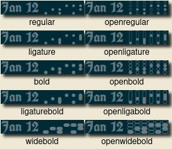

# polybar-binary-clock-fonts &middot; 

Binary clock fonts for your
<picture>
  <source media="(prefers-color-scheme: dark)" srcset="https://raw.githubusercontent.com/polybar/polybar/master/doc/_static/banner-dark-mode.png">
  
</picture>

## Description
This repo is a collection of fonts that represent numbers in base 2 to provide a binary clock time display. Each font contains glyphs for 0-9 only. Just save and load into polybar like the rest of your fonts! Since these fonts are just numbers, any separator or other character you use in your time display will come from the first font you load that contains it. 

### Preview

### Action Shot

