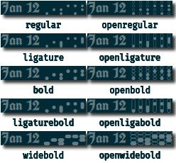

<h1 align="center">polybar-binary-clock-fonts</h1>

&nbsp;

&nbsp;

Binary clock fonts for your

<picture>
  <source media="(prefers-color-scheme: dark)" srcset="https://raw.githubusercontent.com/polybar/polybar/master/doc/_static/banner-dark-mode.png">
  
</picture>

	
	
	

&nbsp;

## Description
This repo is a collection of fonts that represent numbers in base 2 as columns of dots like on a [binary clock](https://en.wikipedia.org/wiki/Binary_clock). The only glyphs are 0-9. Other characters will display in the first font that contains them. Use [time-alt/date-alt settings](https://github.com/polybar/polybar/wiki/Module:-date#basic-settings) to switch to your normal format. Use [format tags](https://github.com/polybar/polybar/wiki/Formatting#format-tags) to show time in a different color from the date.

## Installation
Save the `.ttf` files to `/usr/share/fonts/someFolder`, load into polybar, and use like any other font.

## Appearance
On my 20px polybar with font size 15, vertical offset 4:
|Font Table|Running Clock|
|:-:|:-:|
|<picture><source media="(prefers-color-scheme: dark)" srcset="montagedark.jpg"></picture>||

&nbsp;

